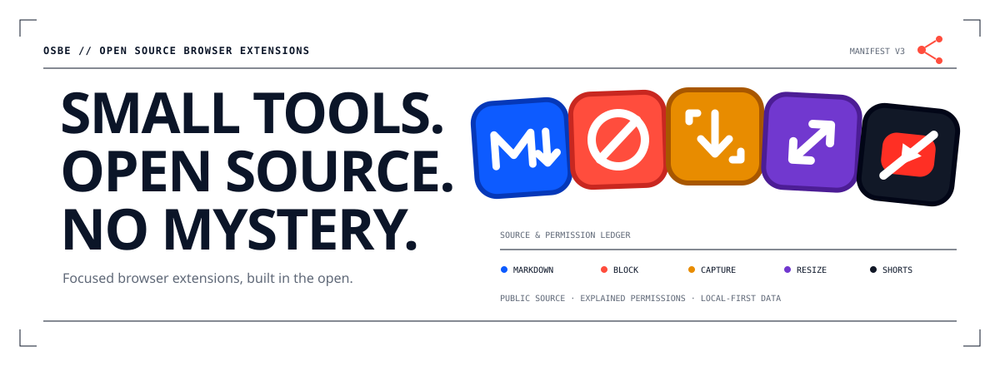

<p align="center">
  
</p>

<p align="center">
  <strong>Five focused Chrome extensions. One inspectable foundation.</strong><br>
  Public source, plain-language permissions, local-first behaviour, and no hidden business model.
</p>

<p align="center">
  <a href="#extensions">Browse extensions</a>
  ·
  <a href="#what-open-means-here">Read the trust contract</a>
  ·
  <a href="docs/create-extension.md">Build your own</a>
</p>

## Extensions

Every OSBE extension has one job, one canonical source directory, and an explicit explanation of what it can access.

|                                                                                 | Extension                  | Clear job                                                                                   | Runs             | Get it                                                                                                                                      |
| ------------------------------------------------------------------------------- | -------------------------- | ------------------------------------------------------------------------------------------- | ---------------- | ------------------------------------------------------------------------------------------------------------------------------------------- |
|        | **Markdown Clipper**       | Save pages and selections as clean Markdown with preview, copy, download, and local images. | On click         | [Chrome Web Store](https://chromewebstore.google.com/detail/hijgngliofllfijnhkjdhjmeaicdplim) · [Source](extensions/markdown-clipper)       |
|            | **Site Blocker**           | Block distracting sites with local rules and time-limited access.                           | On navigation    | [Chrome Web Store](https://chromewebstore.google.com/detail/fnlmommeiggegkgonapopokbcjgldfbe) · [Source](extensions/site-blocker)           |
|       | **Full Page Capture**      | Capture complete pages as PNG or paginated PDF.                                             | On click         | [Chrome Web Store](https://chromewebstore.google.com/detail/balnbaioojcljaepfbnmcalphndfnfjm) · [Source](extensions/full-page-capture)      |
|          | **Window Resizer**         | Resize Chrome windows and page viewports with built-in or custom presets.                   | On click         | [Chrome Web Store](https://chromewebstore.google.com/detail/hepffihmlbanfkibiacnhenmlbeohjaf) · [Source](extensions/window-resizer)         |
|  | **YouTube Shorts Remover** | Remove Shorts from navigation, feeds, search, recommendations, and direct viewing.          | On `youtube.com` | [Chrome Web Store](https://chromewebstore.google.com/detail/ggbofifdkhmddbcccefgdkhaglnbdino) · [Source](extensions/youtube-shorts-remover) |

The product colours are deliberately different at toolbar size. The shared shape says “OSBE”; blue, coral, amber, violet, and ink-red tell you which tool you are reaching for.

## What “open” means here

Open source is useful only when the product makes the important facts easy to find.

| Source                                            | Permissions                                                            | Data                                                        | Runtime                                                                       |
| ------------------------------------------------- | ---------------------------------------------------------------------- | ----------------------------------------------------------- | ----------------------------------------------------------------------------- |
| Every shipped extension lives in this repository. | Every requested browser permission has a plain-language justification. | Extension data stays local unless a product says otherwise. | Each README explains whether code runs on click, navigation, or a named site. |

OSBE extensions contain no remote code. They do not use OSBE accounts, advertising, or analytics. Product-specific behaviour and any sensitive browser access are documented in each extension’s `README.md`, `PRIVACY.md`, and `extension.config.json`.

> The code is the product. Inspect it, build it, or fork it.

## Quick start

Requirements: Node.js 20+ and pnpm 10.

```bash
pnpm install
pnpm extension list
pnpm extension dev markdown-clipper
```

Load the generated development extension from:

```text
extensions/markdown-clipper/build/chrome-mv3-dev
```

Run the complete repository check:

```bash
pnpm check
```

Or work with one extension:

```bash
pnpm extension check site-blocker
pnpm extension smoke site-blocker
pnpm extension package site-blocker
```

## Build your own

The extension generator creates a typed, branded baseline with the same metadata, UI, artwork, validation, and release conventions used by the OSBE catalogue.

```bash
pnpm new:extension my-extension "OSBE My Extension"
pnpm new:extension page-tool "OSBE Page Tool" --surface action-result
pnpm new:extension settings-tool "OSBE Settings Tool" --surface dashboard
pnpm new:extension page-cleaner "OSBE Page Cleaner" \
  --surface content-only \
  --match "https://example.com/*"
```

See [the extension creation guide](docs/create-extension.md) for surface choices, release metadata, store artwork, privacy documentation, and the submission checklist.

## Website

The OSBE website lives in [`apps/website`](apps/website). It reads extension metadata and canonical icons directly from the monorepo, so the public catalogue cannot quietly drift from the products.

```bash
pnpm --filter @osbe/website dev
pnpm --filter @osbe/website build
```

## Repository map

```text
apps/website/                 Public OSBE catalogue and brand site
extensions/*/                 One directory per shipped extension
  extension.config.json       Product, permission, store, and release facts
  assets/icon-source.svg      Canonical toolbar/store icon
  README.md                   Behaviour and architecture
  PRIVACY.md                  Product-specific privacy policy
packages/extension-kit/       Typed browser messaging, storage, and tab helpers
packages/ui/                  Shared components and theme tokens
packages/config/              Shared Plasmo, TypeScript, Tailwind, and PostCSS policy
scripts/                      Generator, validation, artwork, smoke, and release tools
docs/brand.md                 Brand, voice, colour, and icon system
```

Extensions are discovered from their own metadata; there is no registry to update. The same definition powers validation, store dossiers, release workflows, and the website catalogue.

## Contributing

Good contributions make an extension easier to understand, safer to operate, or simpler to maintain.

1. Pick one focused change.
2. Read the target extension’s `README.md`, `PRIVACY.md`, and `extension.config.json`.
3. Add or update tests at the behaviour boundary.
4. Run `pnpm check`.
5. Explain any permission, storage, or runtime change explicitly in the pull request.

Ideas and bug reports are welcome in [GitHub Issues](https://github.com/FranciscoMoretti/osbe/issues).
