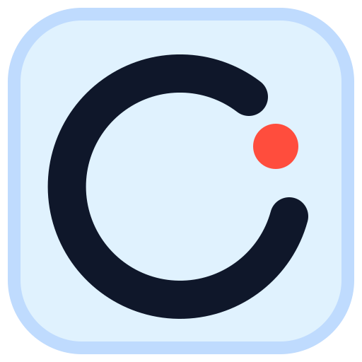

# OSBE Brand Brief

OSBE stands for Open Source Browser Extensions: small, transparent browser tools that users can inspect, reason about, clone, and adapt.

## Core Idea

Browser extensions run close to private browsing activity. Many ask for invasive permissions, and users are often expected to trust an unknown developer or company without a practical way to verify what is installed.

OSBE exists to make useful browser extensions feel understandable again. Each extension should be open source, narrowly scoped, and clear about what it can access and when it runs.

## Positioning

OSBE is an open-source collection of focused browser extensions for people who want useful tools without opaque permissions.

The brand should compete on trust, clarity, and restraint rather than on having the most features.

## Tagline Options

- Browser extensions you can inspect.
- Browser extensions you can trust.
- Useful extensions. Open by default.
- Small browser tools, transparent by design.
- Know what your extension can do.
- Open-source extensions with fewer leaps of faith.

Recommended primary tagline:

```text
Browser extensions you can trust.
```

It is short, memorable, and directly addresses the problem OSBE exists to solve. The surrounding copy should make the trust claim specific: open source, focused permissions, user-invoked behavior, and clear build instructions.

## One-Liner

OSBE builds open-source browser extensions with focused permissions, clear behavior, and code users can inspect or fork.

## Short Description

OSBE is a collection of open-source browser extensions built around transparency and restraint. Each extension is designed to do one useful job, request only the permissions it needs, and make its behavior inspectable through public source code.

## Longer Description

Browser extensions can be powerful, but that power often comes with broad access to pages, tabs, downloads, and browsing data. OSBE was created for users and developers who want useful browser tools without treating trust as a black box.

Every OSBE extension is open source, focused in scope, and explicit about its permissions. You can install the published extension, review the code, build it yourself, or fork it for your own workflow.

## Brand Pillars

### Transparent

The source code, permissions, and behavior should be easy to find and understand. Do not hide behind vague privacy language.

### Minimal

Each extension should solve one clear problem and avoid broad permissions unless they are truly required.

### User-Controlled

Extensions should run because the user invoked them. The user should understand when an extension reads page content, writes files, or changes browser state.

### Forkable

OSBE should feel like a set of useful products and a set of starting points. Developers should be able to clone, modify, and build their own versions.

## Voice

OSBE should sound calm, technical, and direct.

Use:

- "This extension runs when you click it."
- "The source code is public."
- "It requests `activeTab` instead of broad host permissions."
- "Build it yourself or fork it."

Avoid:

- "Military-grade security"
- "Completely safe"
- "Privacy guaranteed"
- "The ultimate extension platform"
- Fear-heavy language that makes the browser extension ecosystem sound universally hostile

## Message Hierarchy

1. Extensions can be invasive, so trust matters.
2. OSBE extensions are open source and inspectable.
3. Each extension is narrowly scoped and permission-conscious.
4. Users can install, review, self-build, clone, or fork.
5. Markdown Clipper is the first example; more focused tools will follow.

## Website Hero Draft

```text
OSBE

Browser extensions you can trust.

Open-source browser extensions built with focused permissions, clear behavior, and public source code. Install them, review them, build them yourself, or fork them for your own workflow.
```

Primary action:

```text
Browse extensions
```

Secondary action:

```text
View source
```

## Markdown Clipper Copy

### Product One-Liner

OSBE Markdown Clipper saves pages and selections as portable Markdown files.

### Store Short Description

Clip pages or selected content into Markdown with local image assets, user-invoked access, and no broad host permissions.

### Store Positioning

Markdown Clipper is the first OSBE extension: a focused, open-source tool for saving web content as Markdown. It runs only when you invoke it from the popup or context menu, and it uses `activeTab` rather than broad site access.

## Trust Copy Pattern

Every extension page should answer these questions plainly:

- What does it do?
- What permissions does it request?
- When does it run?
- What data does it read?
- What data does it store or transmit?
- Where is the source code?
- How can I build it myself?

Suggested section title:

```text
What this extension can access
```

## Naming System

Use OSBE as the umbrella brand and clear functional product names for extensions.

Pattern:

```text
OSBE [Function]
```

Examples:

- OSBE Markdown Clipper
- OSBE Link Cleaner
- OSBE Tab Notes
- OSBE Page Archive
- OSBE Form Filler

For public pages, introduce the full name once:

```text
Open Source Browser Extensions (OSBE)
```

Then use:

```text
OSBE
```

## Visual Direction

The visual system should feel open, precise, and utilitarian rather than cyber-security themed.

Suggested attributes:

- Clean UI screenshots
- Source-code and permission details shown as first-class content
- High contrast text
- Simple line icons
- Product screenshots over abstract illustration
- Plain language privacy callouts

Avoid:

- Padlock-heavy security cliches
- Dark hacker aesthetics
- Excessive gradients
- Vague stock imagery
- Claims that imply open source alone guarantees safety

## Color Direction

Use a practical palette that supports documentation, extension UI, store artwork, and the minimal glass icon family. The palette should read as transparent and technical, with ink as the primary UI color, blue/cyan as restrained connective accents, and red reserved for blocking or destructive states.

- Ink: `#0f172a`
- Paper: `#f8fafc`
- Surface: `#ffffff`
- Glass: `#e0f2fe`
- Glass Border: `#bfdbfe`
- Source Blue: `#005fe8`
- Glass Cyan: `#0ea5e9`
- Block Red: `#ff4d3d`
- Verify Green: `#16a34a`
- Caution Amber: `#d97706`

Ink is the primary UI/action color, matching the high-contrast foreground marks in the icon system. Blue is the connective product accent, and cyan should appear as a focus color or small reflective detail rather than a heavy background treatment. Avoid top-edge accent strips in icons and product UI. Red should be used for the site blocker icon, destructive actions, and explicit blocked states. Green and amber should be reserved for meaningful trust, permission, and warning states.

## Theme Tokens

OSBE UI should use shadcn-style CSS variables so extension popups, docs, and future apps can share the same semantic theme.

Recommended light theme tokens:

```css
:root {
  --background: 210 40% 98%;
  --foreground: 222 47% 11%;
  --card: 0 0% 100%;
  --card-foreground: 222 47% 11%;
  --popover: 0 0% 100%;
  --popover-foreground: 222 47% 11%;
  --primary: 222 47% 11%;
  --primary-foreground: 0 0% 100%;
  --secondary: 210 40% 96%;
  --secondary-foreground: 222 47% 11%;
  --muted: 210 40% 96%;
  --muted-foreground: 215 16% 47%;
  --accent: 199 100% 96%;
  --accent-foreground: 222 47% 11%;
  --destructive: 5 100% 62%;
  --destructive-foreground: 0 0% 100%;
  --border: 214 32% 91%;
  --input: 214 32% 91%;
  --ring: 199 89% 48%;
  --radius: 0.5rem;

  --brand-ink: 222.2 47.4% 11.2%;
  --brand-paper: 210 40% 98%;
  --brand-blue: 215.4 100% 45.5%;
  --brand-cyan: 198.6 88.7% 48.4%;
  --brand-red: 4.9 100% 62%;
  --brand-green: 142.1 76.2% 36.3%;
  --brand-amber: 32.1 94.6% 43.7%;
  --brand-glass: 204 93.8% 93.7%;
  --brand-glass-border: 213.3 96.9% 87.3%;
}
```

Use semantic tokens first:

- Primary actions: `primary`
- Blue/cyan accents: `brand-blue`, `brand-cyan`, `accent`, and `ring`
- Quiet panels and status backgrounds: `muted`, `secondary`, or `accent`
- Blocking and errors: `destructive`
- Focus outlines: `ring`
- OSBE-specific art direction: `brand-*`

## Product UI Direction

Extension menus should follow the minimal logo system rather than mimic the richer icon rendering.

Use:

- Solid paper or white backgrounds
- Ink primary buttons
- Small cyan or blue accents in icons and focus rings
- Simple borders over shadows
- One clear action per popup
- Small metadata text for trust details such as "Runs on click" and "Current tab only"

Avoid:

- Decorative radial gradients in product UI
- Top accent rules or top-edge highlight strips
- Heavy glass panels, blur layers, or glow effects
- Multiple bordered pills when plain metadata is enough
- Bright blue primary buttons unless the product meaning specifically needs blue
- Card-heavy layouts inside small extension popups

## Logo Direction

The icon family should suggest transparency, small focused tools, and browser-native utility. Use a pale, translucent glass tile to communicate inspectability without leaning on security cliches, but keep toolbar icons simple enough to read at `16px`.

Canonical icons:




Good concepts:

- A rounded-square liquid-glass app tile with one simple high-contrast symbol inside
- A near-black foreground mark over a very light glass background
- An inverted dark-ink tile with a white or pale-cyan symbol when the icon appears on a light product surface
- A restrained cyan side or lower edge only when extra separation is needed
- At most one large functional accent badge when a second concept is essential
- The letters OSBE in a plain wordmark paired with the glass module icon
- Extension variants that keep the same glass tile, blue lighting, and border radius while changing only the functional symbol

Avoid angle brackets, shields, locks, and puzzle-piece cliches. OSBE is about inspectability and user agency, not a promise of invulnerability.

Extension icon system:

- OSBE base: glass tile plus a simple near-black open/source mark.
- Markdown Clipper: glass tile plus a large near-black Markdown mark (`M` with the down-arrow to its right) and one large coral paperclip badge overlapping the arrow.
- Inverted OSBE base: dark ink tile plus a simple white open/source mark.
- Inverted Markdown Clipper: dark ink tile plus a large white Markdown mark (`M` with the down-arrow to its right); use a light or coral paperclip badge only if it retains toolbar contrast.
- Site Blocker: glass tile plus a simple browser/page shape with a large red block sign over the page.
- Future extensions: same glass tile, same lighting, same border radius, unique inner symbol.

Icon rules:

- Keep icons square at `1:1`.
- Optimize the inner symbol for browser-toolbar sizes first.
- Prefer one strong primary symbol. If the product needs a secondary concept, express it as one simple badge that occupies at least one quarter of the tile height.
- Use a light glass base with restrained cyan support only when it improves separation.
- Keep accent badges semantically meaningful and draw them above the primary mark; do not use colored stroke underlays or decorative shadows.
- Avoid top-edge color strips; they read as decoration rather than brand.
- Keep toolbar foreground marks black or near-black unless color is essential to the product meaning.
- Use inverted dark-tile icons on light popup/menu surfaces when the pale glass icon loses contrast.
- Use coral red sparingly for a single high-attention functional badge, such as block/stop or clip/attach; never use it as general decoration.
- Do not use a puzzle piece as the main symbol; it is too generic for OSBE extension products.
- Maintain one canonical `assets/icon-source.svg` per extension and generate runtime and store icons from it with `pnpm extension artwork <slug>`.
- Treat browser-toolbar icons and store artwork separately: toolbar icons should be simpler, flatter, and higher contrast; store artwork can use richer liquid-glass rendering.

## Extension Quality Principles

Each OSBE extension should aim to satisfy these before release:

- Public source code
- Minimal declared permissions
- User-invoked behavior where possible
- Clear privacy explanation
- Reproducible local build instructions
- Store listing that names the sensitive permissions
- README that explains what runs in background, popup, content scripts, and offscreen documents
- Small enough scope that a developer can understand the core behavior quickly

## First Brand Narrative

OSBE started with Markdown Clipper because clipping a page should not require trusting a black box with broad browsing permissions. The extension does one job: it turns the current page or selected content into Markdown. Its permissions are limited, its behavior is user-invoked, and the source is available for anyone to inspect or fork.

That same model should guide future OSBE extensions: simple browser tools, built in the open, with permissions users can reason about.
